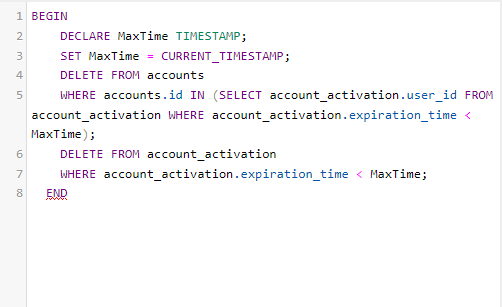

# JobSE - Job finding made easy

#### Autorzy: Sławomir Smolak, Tomasz Solender

Projekt JobSE to aplikacja dla prawconików jak i pracodawców. Zadaniem JobSE jest ułatwienie szukania pracy oraz znajdowania pracowników. Tworzenie ofert pracy oraz z cv prosto z okna przeglądarki.
Demo przedstawia wersję testwową aplikacji.
Wersja testowa posiada: 

1. Rejestrację i aktywację konta (poprzez wysyłanie maila),
2. Logowanie i zapamiętywania użytkownika,
3. Dla pracowników: dodawanie CV, przegląanie i aplikowanie ofert,
4. Dla pracodawców: doawanie ofert, przegląanie CV osób ubiegających się o pracę,

Projekt został napisany przy użyciu HTML5, CSS3 i jQuery (JS) (front-end) oraz PHP i MySql (back-end).

### Ciekawostka
Dodaliśmy także zdarzenie w SQL, które powowduje usunięcie nie aktywowanych kont.
  

Z powodu małej ilości czasu na wykonanie projektu mogą występować miejscami błędy lub niedopatrzenia. Serdecznie za nie przepraszamy.

### Wykorzystane biblioteki:

- jQuery [_link_](https://jquery.com)
- Google Fonts [_link_](https://fonts.google.com)
- Font Awesome [_link_](https://fontawesome.com)
- International Telephone Input [_link_](https://github.com/jackocnr/intl-tel-input)
- Country Select JS [_link_](https://github.com/mrmarkfrench/country-select-js)
- PHPMailer [_link_](https://github.com/PHPMailer/PHPMailer)
- libphonenumber for PHP (Lite) [_link_](https://github.com/giggsey/libphonenumber-for-php-lite)
